# Intro to NodeRED
This repository is aimed at beginners, where it introduces NodeRED and the different most commonly used nodes.

## Node-RED on IBM Cloud

Node-RED is an open source visual flow-based programming tool used for wiring not only Internet of Things (IoT) components, but also integrating an ensemble of service APIs, including ones provided by IBM Cloud. A node in NodeRED performs a particular functionality, aiming at providing a way to minimize the amount of coding needed to build a given application.

More information about Node-RED, including the documentation, can be found [here](https://nodered.org/).

## Pre-requisite

An IBM Cloud account - A lite account, which is a free of charge account that doesn’t expire, can be created through going to [IBM Cloud](http://ibm.biz/sharjahinnovation2019).

## Creating the Node-RED Application

* To simplify things, a boilerplate called **Node-RED Starter** is used. Go to **Catalog** followed by selecting **Boilerplates**, which will be seen on the menu available on the left-hand side under **Platform**

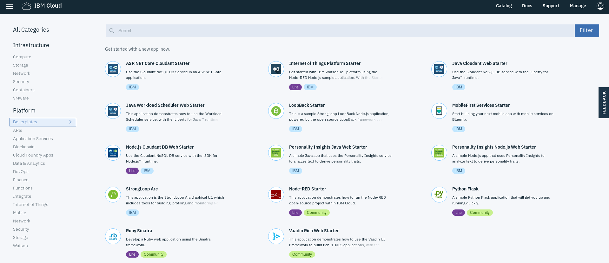

* Enter a unique name for the application being created, which is also used as the hostname. If you are using a lite account, the region is set to that chosen while applying for the account. Make sure to select the appropriate region, organization , and space

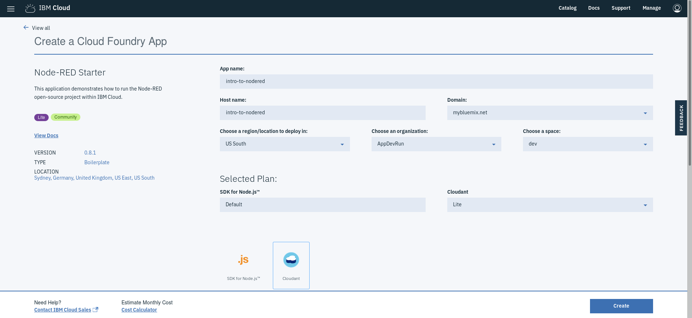

After clicking on **create**, an instance of the Node-RED application (which uses Node.js to create server-side JavaScript applications) is created to which a **Cloudant NoSQL** database is bound. It will take some time for the application status to change to **awake** or **Running**, indicating that it is running.

## Setting Up the Node-RED Application & a Quick Tour

* Go back to the **Dashboard** and click on the application you created earlier (in this example, it was called "intro-to-nodered") 
* In order to access the Node-RED editor used to build the application, click on **Visit App URL**.
* Follow the directions to access the Node-RED editor (you are encouraged to secure your Node-RED editor to ensure that only authorized users can access it)


* Click on **Go to your Node-RED flow editor**. This should open a fresh new flow in the Node-RED flow editor called *Flow 1*

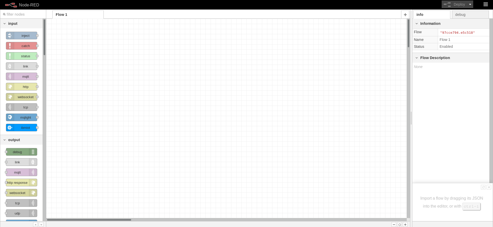

You can edit the flow workspace name by double-clicking on the tab called Flow 1. You will be able to a number of node on the left, each representing a functionality and can be dragged into the flow workspace. On the right, you will find 2 tabs:
**info** - provide node and node help information on the selected node
**debug** - acts as the debug window to which message can be dispalyed when the **debug** node is used
At the top right corner of the page, you can see the **Deploy** button to deplay a particular flow or all flows, and the hamburger menu. The hamburger menu gives you access to the **Settings**, allows you to import and export flows as JSON objects, create **Subflows** and install additional nodes through **Manage palette**. Note that you can also import & export flows that can be part of a library you define
**Subflows** group together multiple nodes that aim to perform a certain task, which you can treat as a function that can use at different places when needed. It also allows for a cleaner view.
**Manage palette** allows you to see all of the currently installed nodes in addition to specifying any nodes that you wish to install (example **random** node that outputs random number with a particular range)

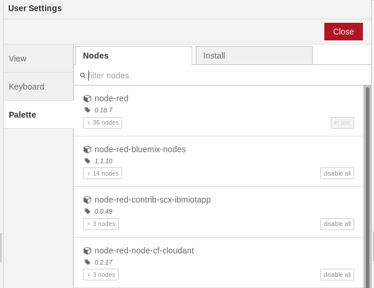

## Some NodeRED Nodes & Sample Flows

### Inject & Debug Nodes
The **inject node** found under **input** on the left handside injects a message, which can be one of a variety of types, into the flow either manually or at regular intervals. The **debug node** under **output** on the left handside displays the recieved messages, whether a particular property of that message or the entire message, in the debug sidebar tab and optionally the runtime log. To test each, follow these steps:

* Drag and drop both the **inject** and **debug** nodes into the flow workspace and connect it


* Double-click on the inject node and change the payload, which represents the message you are injecting into your flow as you wish (select any of the different type). You also select if you would like the message to be inject at regular interval and/or at the beginning when the flow is deployed. For simplicity, it is kept as **timestamp**

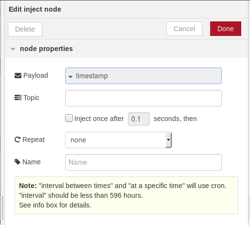

* Click  *Done*
* Double-click on the **debug** node and enter the property to display and where to display it. In this example, we need to look at the payload with the injected message and send it to the **debug window**

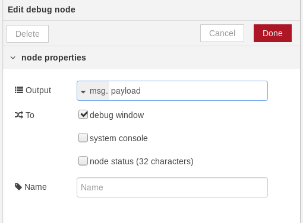

* Click  **Done**
** Click **Deploy** (found at the top right corner of the window)


* Click on the square sticking out of the **inject** node and you will see the timestamp printed in the the debug window. Make sure that the debug node is enabled (can be disabled by clicking on the square sticking out of the node)

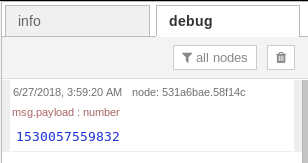

### Change & Switch Nodes
The **switch** node routes messages based on message property value(s) while the **change** node can be used to modify a message object or a flow/global context objects, including the operations: set, change/replace, move & delete. To test each, follow these steps:
* Add the **inject** node as described in the *Inject & Debug Nodes* subsection
* Add the **change** node followed by the **switch** node between the **inject** and **debug** nodes
* Configure the **change** node as seen below, where the message payload will be set to the number 5

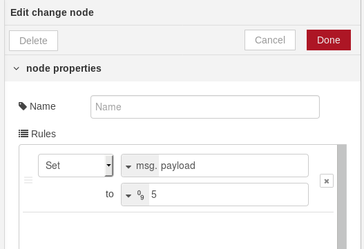

* Configure the **switch** node as seen below, where the messages will be routed based on whether the payload is less than or equal to 5 or greater than 5

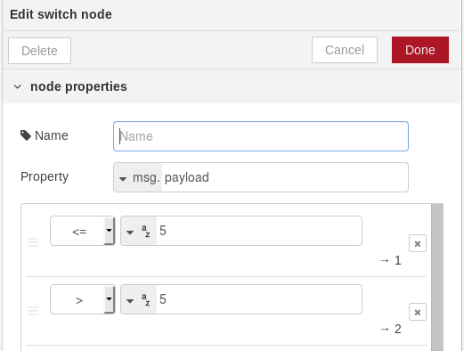

* Connect a **change** node to each of the outputs of the **switch** node to set a message indicating whether the payload was less than or equal to 5 (1st output) or greater than 5 (2nd output) and connect each **change** node to the **debug** node to see the result

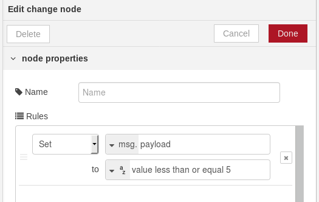


* Click **Deploy**
* Once the message is injected, the output will look like the following, based on this example

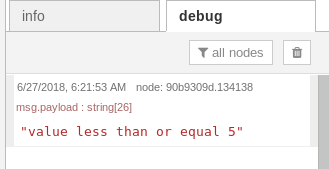

The full flow will as follows


### HTTP In, HTTP Response, HTTP Request & NodeRED Template Nodes
The **HTTP in**/**HTTP input** node is an input node for http requests used to create an HTTP end-pont for creating web services. **HTTP response** node sends responses back to HTTP requests received from an HTTP input node. The **HTTP request** node calls a web end point. **HTTP in** and **HTTP response** nodes, along with **change** node that sets the header to define things like the expected return content type, are used to together to create a web service; whereas, **HTTP Request** node is used to call an already existing web service or REST API. A **template** node can also be combined with the **HTTP in** and **HTTP response** to return things like a webpage. It provides mustache-style templated content containing tokens that will be replaced with incoming message(s). 
To start off, let's first examine the **template** node:
* Add & connect the **inject** and **debug** nodes, but set the type of the payload to **string** and the value to *Sending a message to the template node*

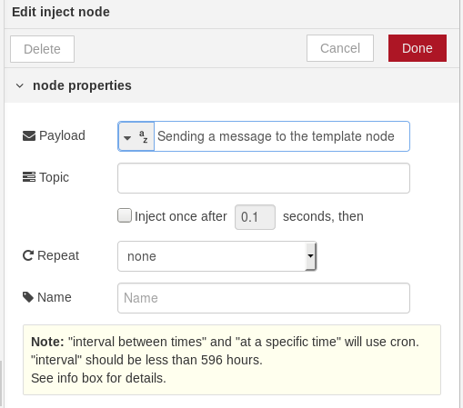

* Add a NodeRED **template** node, which is under **function** between **inject** and **debug** nodes


* Edit the NodeRED **template** node as follows

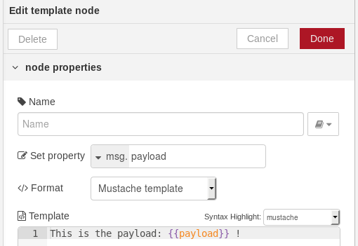

* Click **Deploy**
* Once the message is injected, the output will look like the following

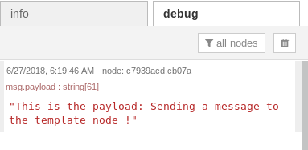

Selecting **Mustache template** as format is needed so that any message property surrounded by {{..}} or {{{..}}} (triple braces are used to prevent escaping any HTML entities) would be replaced by the value of the specified property. Mustache is called as such due to the usage of curly brackets that makes it look like a mustache.

Next, we will make a web service thatwill return a sample web page
* Connect **HTTP input**, **change**, NodeRED **template** and **HTTP response** nodes in the order specified
* Edit **HTTP input** node to specify the end-point/URL to be used in a HTTP request

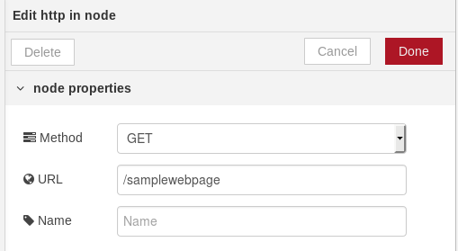

* Set the headers by modifying the **change** node to ste the expected return type

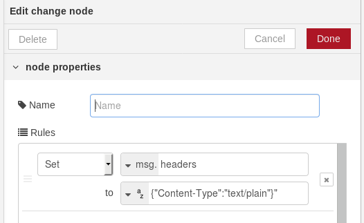

* Copy the following that uses Bootstrap to create the web page
```HTML
<!DOCTYPE html>
<html lang="en">
<head>
  <!-- Theme Made By www.w3schools.com - No Copyright -->
  <title>Natural Disaster Awareness</title>
  <meta charset="utf-8">
  <meta name="viewport" content="width=device-width, initial-scale=1">
  <link rel="stylesheet" href="https://maxcdn.bootstrapcdn.com/bootstrap/3.3.7/css/bootstrap.min.css">
  <link href="https://fonts.googleapis.com/css?family=Lato" rel="stylesheet" type="text/css">
  <link href="https://fonts.googleapis.com/css?family=Montserrat" rel="stylesheet" type="text/css">
  <script src="https://ajax.googleapis.com/ajax/libs/jquery/3.3.1/jquery.min.js"></script>
  <script src="https://maxcdn.bootstrapcdn.com/bootstrap/3.3.7/js/bootstrap.min.js"></script>
  <style>
  body {
      font: 400 15px/1.8 Lato, sans-serif;
      color: #777;
  }
  h3 {
      margin: 10px 0 30px 0;
      letter-spacing: 10px;      
      font-size: 20px;
      color: #111;
  }
  .container {
      padding: 80px 120px;
  }

  .carousel-inner img {
      -webkit-filter: grayscale(90%);
      filter: grayscale(90%); /* make all photos black and white */ 
      width: 100%; /* Set width to 100% */
      margin: auto;
  }
  .carousel-caption h3 {
      color: #fff !important;
  }
  @media (max-width: 600px) {
    .carousel-caption {
      display: none; /* Hide the carousel text when the screen is less than 600 pixels wide */
    }
  }

  .nav-tabs li a {
      color: #777;
  }
  .navbar {
      font-family: Montserrat, sans-serif;
      margin-bottom: 0;
      background-color: #2d2d30;
      border: 0;
      font-size: 11px !important;
      letter-spacing: 4px;
      opacity: 0.9;
  }
  .navbar li a, .navbar .navbar-brand { 
      color: #d5d5d5 !important;
  }
  .navbar-nav li a:hover {
      color: #fff !important;
  }
  .navbar-nav li.active a {
      color: #fff !important;
      background-color: #29292c !important;
  }
  .navbar-default .navbar-toggle {
      border-color: transparent;
  }

  footer {
      background-color: #2d2d30;
      color: #f5f5f5;
      padding: 32px;
  }
  footer a {
      color: #f5f5f5;
  }
  footer a:hover {
      color: #777;
      text-decoration: none;
  }  

  

  </style>
</head>
<body id="myPage" data-spy="scroll" data-target=".navbar" data-offset="50">

<nav class="navbar navbar-default navbar-fixed-top">
  <div class="container-fluid">
    <div class="navbar-header">
      <button type="button" class="navbar-toggle" data-toggle="collapse" data-target="#myNavbar">
        <span class="icon-bar"></span>
        <span class="icon-bar"></span>
        <span class="icon-bar"></span>                        
      </button>
      <a class="navbar-brand" href="#myPage">Natural Disasters</a>
    </div>
    <div class="collapse navbar-collapse" id="myNavbar">
      <ul class="nav navbar-nav navbar-right">
        <li><a href="#myPage">HOME</a></li>
        <li><a href="#earthquake">EARTHQUAKES</a></li>
        <li><a href="#contact">CONTACT</a></li>
      </ul>
    </div>
  </div>
</nav>

<div id="myCarousel" class="carousel slide" data-ride="carousel">
    <!-- Indicators -->
    <ol class="carousel-indicators">
      <li data-target="#myCarousel" data-slide-to="0" class="active"></li>
      <li data-target="#myCarousel" data-slide-to="1"></li>
    </ol>

    <!-- Wrapper for slides -->
    <div class="carousel-inner" role="listbox">
      <div class="item active">
        
        <div class="carousel-caption">
          <h3>Earthquakes</h3>
          <p>Monitor current earthquakes, twitter posts and observe some statistics</p>
        </div>      
      </div>
    
      <div class="item">
        
        <div class="carousel-caption">
          <h3>Natural Disaster Preparedness</h3>
          <p>Natural disaster preparedness programs & tips are very important!</p>
        </div>      
      </div>
    </div>

    <!-- Left and right controls -->
    <a class="left carousel-control" href="#myCarousel" role="button" data-slide="prev">
      <span class="glyphicon glyphicon-chevron-left" aria-hidden="true"></span>
      <span class="sr-only">Previous</span>
    </a>
    <a class="right carousel-control" href="#myCarousel" role="button" data-slide="next">
      <span class="glyphicon glyphicon-chevron-right" aria-hidden="true"></span>
      <span class="sr-only">Next</span>
    </a>
</div>

<!-- Container (The Earthquake Section) -->
<div id="earthquake" class="container text-center">
  <h3>EARTHQUAKES</h3>
  <p><em>The Energy of Earthquakes</em></p>
  <p>Each year, earthquakes cause devastation to the thousands of people all over the world. In 2010 alone, there were over 21,000 earthquakes recorded. The Richter magnitude scale, is a measurement of the seismic energy released by an earthquake. It is a logarithmic scale, so a 5.0 on the Richter scale has a shaking amplitude 10 times larger than one that measures 4.0.</p>
  <p>Taken from http://www.infographicszone.com/geography/top-5-earthquake-infographics)</p>
  <br>
</div>

<!-- Container (Contact Section) -->
<div id="contact" class="container">
  <h3 class="text-center">Contact</h3>
  <p class="text-center"><em>Details of who to contact in case of emergency</em></p>

  <div class="row">
    <div class="col-md-4">
      <p><span class="glyphicon glyphicon-map-marker"></span>  Some location</p>
      <p><span class="glyphicon glyphicon-phone"></span>  Phone: +123 45 6666666</p>
      <p><span class="glyphicon glyphicon-envelope"></span>  Email: someemail@email.com</p>
  <br> 
  </div>
  </div>
  </div>


<!-- Footer -->
<footer class="text-center">
  <a class="up-arrow" href="#myPage" data-toggle="tooltip" title="TO TOP">
    <span class="glyphicon glyphicon-chevron-up"></span>
  </a><br><br>
  <p>Built By <a href="https://developer.ibm.com/code/community/advocates/advocate/mahitab.hassan" data-toggle="tooltip" title="Developer Experience Advocate">Mahitab Hassan</a> With Reference From
  <a href="https://www.w3schools.com" data-toggle="tooltip">www.w3schools.com</a></p> 
</footer>

<script>
$(document).ready(function(){
  // Initialize Tooltip
  $('[data-toggle="tooltip"]').tooltip(); 
  
  // Add smooth scrolling to all links in navbar + footer link
  $(".navbar a, footer a[href='#myPage']").on('click', function(event) {

    // Make sure this.hash has a value before overriding default behavior
    if (this.hash !== "") {

      // Prevent default anchor click behavior
      event.preventDefault();

      // Store hash
      var hash = this.hash;

      // Using jQuery's animate() method to add smooth page scroll
      // The optional number (900) specifies the number of milliseconds it takes to scroll to the specified area
      $('html, body').animate({
        scrollTop: $(hash).offset().top
      }, 900, function(){
   
        // Add hash (#) to URL when done scrolling (default click behavior)
        window.location.hash = hash;
      });
    } // End if
  });
})
</script>

</body>
</html>
```
* Click **Deploy**
* Try accessing the end-point through your browser and the page should be displayed in return this (the url in our case will be ```https://intro-to-nodered.mybluemix.net/samplewebpage```)


You can then choose to use an **HTTP request** node, in this case or in other cases where you return a JSON object, where you will pass the end-point, the HTTP method, and the return content type expected.A different example can be seen here. 

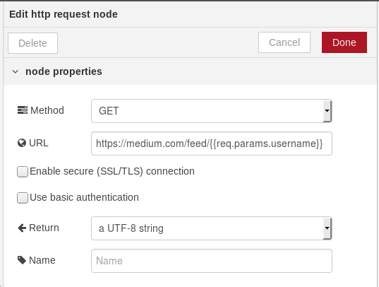

A more comprehensive example flow is provided as part of the JSON object that can be imported.

### Function Node
A **function** node allows you to write javascript code that will perform some action on an incoming messages. Bear in mind, each **function** node has its own sandbox context, which does incur a performance penalty as a sandbox context has to be established when the node is created, and then, each time a message arrives at the **function** node, the runtime has to switch into the function node's context to run the code, and then switch back out of the context when the function node is completed.

### Comment Node
This node allows you to add comment to your flows to increase readability.

### Dashboard Nodes
These set of node allow creating a dashboard very easily and include node such a **chart** node for drawing charts, a **text** node that will display a non-editable text field and a dashboard **template** node that can contain any valid html and Angular/Angular-Material directives. An example is covered in other folder.
To work with these nodes, you need to install a module:
* Go to the hamburger menu and click on **Manage palette**
* In the **Install** tab, search for *node-red-dashboard module* and install it (a new set of nodes will be added and **dashboard** tab will be added on the right hand-side of the page)
To use one of the nodes under the **dashboard** nodes:
* Click on the dashboard tab. You will notice that there are 3 tabs, each used to change the look and feel of the UI
* Create a tab, which can resemble a page in the UI, to which you will add a group that is used to collate similar widgets together. 
Each widget or dashboard component to added to one of the created groups. All components can be customized based on preference.


Note that all node can be named by configuring the node and filling in the name field.

More examples along with the ones previously mentioned here have been provided in the JSON file added to this repository. You can have a look at them by importing the flow. Bear in mind that there are other nodes that you might be interested in exploring that have not been tackled, including Watson services nodes that allow to integrate AI into your application in a simple fashion.

## Adding New Nodes to the Palette
You can search for available nodes on the Node-RED library. To add a node to the editor, you can either use the Palette Manager feature within the editor itself, or manually edit the package.json file.

### Palette Manager

* Within the editor, select the **Manage Palette** option from the hamburger menu
* Go to the Install tab
* Search for the module you're interested in and click install

### Edit package.json

* Edit the file package.json and add the required node package to the dependencies section. The format will be:

```JSON
"node-red-node-package-name":"<DESIRED VERSION>"
```

## Making Packages/Modules Available to the Function Node

* Go to bluemix-setting.js in an editor of your choice
* Find the definition of the *functionGlobalContext* object
* Add your package of choice. To make the package available, define an object attribute with a name and then the require statement as the value:
```javascript
functionGlobalContext: {
  <ATTRIBUTE NAME>:require('<PACKAGE NAME>')
},
```
* To bring the package into the application, define it as a dependency in the package.json file
```JSON
"dependencies": {
   ...,
  "<PACKAGE NAME>":"<DESIRED VERSION>"
},
```
* Save the modifications and make sure the changes are pushed to the Cloud to see the changes reflected
*Once the application has restarted, you will have access to the package from a function node:
```javascript
var variable = global.get('<ATTRIBUTE NAME>');
msg.payload = variable.<SOME FUNCTION>(...);
return msg;
```

## Additional Resources to Explore

[Creating a Node-RED deployment pipeline to IBM Cloud](https://medium.com/@knolleary/creating-a-node-red-deployment-pipeline-to-ibm-cloud-9a8e9d5113de)

[NodeRED roadmap](http://noderedguide.com/)

[Node-RED Whiteboard, Documentation Work, Design Notes, Technical Interchange Meetings](https://github.com/node-red/node-red/wiki)

[NodeRED documentation](https://nodered.org/docs/)

[NodeRED guide](http://noderedguide.com/)

[Dashboard template examples](https://it.knightnet.org.uk/kb/nr-qa/dashboard-template-examples/)

[NodeRED Angular HTTP](https://github.com/victorklijmeij/nod-red-angular-http/)

[Create a web interface using Node-RED to trigger an IBM Watson Studio analytics workflow](https://developer.ibm.com/code/patterns/orchestrate-data-science-workflows-using-node-red/)
